# BIS Admin Portal - Entity Relationship Diagram (ERD)

> 최종 업데이트: 2026-03-26  
> 버전: 1.1

## 1. 개요

BIS(Bus Information System) Admin Portal의 전체 데이터 모델 구조를 정의합니다.

### 1.1 핵심 연동 구조: BIS 단말 관리 ↔ 자산 관리

**BIS 단말 관리(Registry > Devices)에서 등록된 Device가 Asset의 핵심 실체입니다.**

```
┌─────────────────────────────────────────────────────────────────────┐
│                    Device-Asset 연동 구조                            │
└─────────────────────────────────────────────────────────────────────┘

[Registry > BIS 단말 관리]                    [자산 관리]
         │                                         │
         │ 단말 등록                                │
         ▼                                         │
   ┌──────────────┐                                │
   │   DEVICE     │                                │
   │  (RMS 운영)   │◀────── linkedDeviceId ────────┤
   │  통신/상태    │                                │
   └──────┬───────┘                                │
          │                                        │
          │ 1:1 연결                               │
          ▼                                        ▼
   ┌──────────────┐                         ┌──────────────┐
   │    ASSET     │◀── linkedComponents ───│    ASSET     │
   │  (단말 자산)  │                         │  (부속품)    │
   │  terminal    │                         │  battery     │
   └──────────────┘                         │  display     │
          │                                 │  solar_panel │
          │                                 │  sim_card    │
          │                                 └──────────────┘
          ▼
   ┌──────────────────────────────────────────────────────┐
   │                   자산 라이프사이클                    │
   │  입고(Receiving) → 출고(Outgoing) → 설치(Install)    │
   │  이전(Transfer) ← 반품(Return) ← 철거(Remove)        │
   └──────────────────────────────────────────────────────┘
```

#### 연동 우선순위

| 우선순위 | 연동 메뉴 | 관계 | 설명 |
|:--------:|----------|------|------|
| **1 (최강)** | Registry > BIS 단말 관리 | Device = Asset 실체 | 단말 등록 → 자산 자동 생성 |
| **2** | Registry > 파트너 관리 | 창고 소유, 공급사 | 입고 시 공급사, 창고 파트너 |
| **3** | Registry > 고객사 관리 | 자산 소유자 | 출고/반품 대상 고객사 |
| **4** | Registry > 정류장 관리 | 설치 위치 | 자산 설치 정류장 |
| **5** | RMS > 단말 현황 | 운영 모니터링 | Device 통신/상태 조회 |
| **6** | Field Ops > 작업 관리 | 작업 이력 | 설치/수리 시 자산 이력 생성 |

---

## 2. ERD 다이어그램 (Mermaid)

```mermaid
erDiagram
    %% ===== 조직 엔티티 (Organization Entities) =====
    
    PARTNER {
        string id PK "파트너 ID (SH001)"
        string name "회사명"
        enum type "manufacturer|supplier|maintenance_contractor|installation_contractor|service_operator"
        string businessRegNumber "사업자등록번호"
        string companyAddress "회사 주소"
        string ceoName "대표자명"
        string contactPerson1Name "담당자1 이름"
        string contactPerson1Email "담당자1 이메일"
        string contactPerson1Phone "담당자1 연락처"
        string contactPerson2Name "담당자2 이름"
        string contactPerson2Email "담당자2 이메일"
        string contactPerson2Phone "담당자2 연락처"
        enum approvalStatus "unapproved|approved|suspended"
        string suspendReason "정지 사유"
        boolean disabled "소프트 삭제"
        datetime createdAt
        datetime updatedAt
    }

    CUSTOMER {
        string id PK "고객사 ID (CUS001)"
        string name "고객사명"
        enum type "public_enterprise|private_enterprise"
        enum status "unapproved|approved|suspended"
        string businessRegNumber "사업자등록번호"
        string ceoName "대표자명"
        string stakeholderId "이해관계자 ID"
        string serviceCompanyId FK "서비스 운영사 ID"
        string serviceCompanyName "서비스 운영사명"
        int locationCount "정류장 수"
        int bisGroupCount "BIS 그룹 수"
        int deviceCount "단말 수"
        string contactPerson1Name "담당자1 이름"
        string contactPerson1Email "담당자1 이메일"
        string contactPerson1Phone "담당자1 연락처"
        string address "주소"
        datetime createdAt
        datetime updatedAt
    }

    WAREHOUSE {
        string id PK "창고 ID (WH-001)"
        string partnerId FK "파트너 ID"
        string partnerName "파트너명"
        string name "창고명"
        string address "주소"
        string managerName "담당자명"
        string managerPhone "담당자 연락처"
        string managerEmail "담당자 이메일"
        boolean isActive "활성 상태"
        datetime createdAt
        datetime updatedAt
    }

    %% ===== 위치/그룹 엔티티 (Location/Group Entities) =====

    BUS_STOP_LOCATION {
        string id PK "정류장 ID (LOC001)"
        string name "정류장명"
        string busStopId "외부 버스 정류장 ID"
        string address "주소"
        float lat "위도"
        float lng "경도"
        string customerId FK "고객사 ID"
        string customerName "고객사명"
        enum status "active|inactive"
        array linkedBISGroups "연결된 BIS 그룹"
        boolean disabled "소프트 삭제"
        datetime createdAt
        datetime updatedAt
    }

    BIS_GROUP {
        string id PK "BIS 그룹 ID (GRP001)"
        string name "그룹명"
        string customerId FK "고객사 ID"
        string customerName "고객사명"
        string locationId FK "정류장 ID"
        string locationName "정류장명"
        enum status "active|inactive"
        date installationDate "설치일"
        date serviceStartDate "서비스 시작일"
        string maintenanceVendorId FK "유지보수 업체 ID"
        string maintenanceVendorName "유지보수 업체명"
        array primaryDeviceIds "주 단말 ID 목록"
        array bisDeviceConfigIds "BIS 단말 설정 ID"
        boolean disabled "소프트 삭제"
        datetime createdAt
        datetime updatedAt
    }

    %% ===== 장비 엔티티 (Device Entities) =====

    DEVICE {
        string id PK "통신 ID (DEV001)"
        string bisDeviceId UK "BIS 단말 ID (BISD001)"
        string name "단말명"
        enum status "online|offline|warning|maintenance"
        enum lifecycleStatus "pre_installation|installation_scheduled|..."
        string region "지역"
        string group "그룹"
        string stopName "정류장명"
        int batteryLevel "배터리 잔량"
        float lat "위도"
        float lng "경도"
        string customerId FK "고객사 ID"
        enum powerSource "ac|solar|hybrid"
        string type "단말 유형"
        string linkedStopId FK "연결된 정류장 ID"
        datetime installedAt "설치 일시"
        datetime verifiedAt "검수 일시"
        enum displayState "NORMAL|DEGRADED|CRITICAL|OFFLINE|EMERGENCY"
        int socPercent "배터리 SOC %"
        boolean isCharging "충전 중"
        boolean hasFault "장애 여부"
        array faultTypes "장애 유형"
        datetime lastReportTime "마지막 리포트 시간"
        datetime lastUpdated
    }

    BIS_DEVICE_CONFIG {
        string id PK "BIS 단말 설정 ID"
        string deviceId FK "통신 단말 ID"
        string bisGroupId FK "BIS 그룹 ID"
        string displayAssetId FK "디스플레이 자산 ID"
        array peripheralAssetIds "주변장치 자산 ID"
        enum connectionStatus "connected|disconnected"
        datetime createdAt
        datetime updatedAt
    }

    %% ===== 자산 엔티티 (Asset Entities) =====

    ASSET {
        string id PK "자산 ID (AST-001)"
        string assetCode UK "자산 코드"
        enum assetType "terminal|shelter|sensor|router|component"
        enum assetSubType "terminal_solar|terminal_ac|battery_lithium|..."
        string manufacturerId FK "제조사 ID"
        string manufacturerName "제조사명"
        string manufacturerSerial "제조사 시리얼"
        enum ownerType "partner|customer"
        string ownerId FK "소유자 ID"
        string ownerName "소유자명"
        enum status "IN_STOCK|ALLOCATED|INSTALLING|OPERATING|MAINTENANCE|..."
        string currentWarehouseId FK "현재 창고 ID"
        string currentWarehouseName "현재 창고명"
        string currentStopId FK "현재 정류장 ID"
        string currentStopName "현재 정류장명"
        string linkedDeviceId FK "연결된 단말 ID"
        array linkedComponents "연결된 부속품 ID"
        string parentAssetId FK "부모 자산 ID (부속품인 경우)"
        string model "모델명"
        date purchaseDate "구매일"
        date registeredDate "입고일"
        int usageDays "사용 기간 (일)"
        datetime createdAt
        datetime modifiedAt
    }

    ASSET_HISTORY {
        string id PK "이력 ID"
        string assetId FK "자산 ID"
        string assetCode "자산 코드"
        enum actionType "입고|출고|설치|수리|이전|반품|폐기|..."
        string fromLocation "출발지"
        string toLocation "도착지"
        string performedBy "수행자"
        string notes "비고"
        datetime performedAt "수행 일시"
    }

    %% ===== 입출고 엔티티 (Inventory Entities) =====

    RECEIVING_RECORD {
        string id PK "입고 ID (RCV-001)"
        string supplierId FK "공급사 ID"
        string supplierName "공급사명"
        string warehouseId FK "창고 ID"
        string warehouseName "창고명"
        enum status "pending_inspection|passed|failed|partial"
        int totalQuantity "총 수량"
        string receivedBy "입고 담당자"
        datetime receivedAt "입고 일시"
        string inspectedBy "검수자"
        datetime inspectedAt "검수 일시"
        string notes "비고"
        datetime createdAt
    }

    OUTGOING_RECORD {
        string id PK "출고 ID (OUT-001)"
        string partnerId FK "파트너 ID"
        string partnerName "파트너명"
        string warehouseId FK "출발 창고 ID"
        string warehouseName "출발 창고명"
        string customerId FK "고객사 ID"
        string customerName "고객사명"
        string stopId FK "정류장 ID"
        string stopName "정류장명"
        enum status "pending|pending_approval|approved|in_transit|installed|rejected|cancelled"
        int totalQuantity "총 수량"
        string requestedBy "요청자"
        string approvedBy "승인자"
        string installedBy "설치자"
        datetime installedDate "설치 일시"
        datetime createdAt
    }

    TRANSFER_RECORD {
        string id PK "이전 ID (TRF-001)"
        string fromPartnerId FK "출발 파트너 ID"
        string fromPartnerName "출발 파트너명"
        string fromWarehouseId FK "출발 창고 ID"
        string fromWarehouseName "출발 창고명"
        string toPartnerId FK "도착 파트너 ID"
        string toPartnerName "도착 파트너명"
        string toWarehouseId FK "도착 창고 ID"
        string toWarehouseName "도착 창고명"
        enum status "pending|pending_approval|approved|in_transit|completed|rejected|cancelled"
        int totalQuantity "총 수량"
        string requestedBy "요청자"
        string approvedBy "승인자"
        string transferredBy "이전 담당자"
        datetime createdAt
    }

    RETURN_RECORD {
        string id PK "반품 ID (RTN-001)"
        string customerId FK "고객사 ID"
        string customerName "고객사명"
        string stopId FK "정류장 ID"
        string stopName "정류장명"
        string toPartnerId FK "수령 파트너 ID"
        string toPartnerName "수령 파트너명"
        string toWarehouseId FK "수령 창고 ID"
        string toWarehouseName "수령 창고명"
        enum status "requested|in_transit|received|re_stocked|cancelled"
        enum returnReason "malfunction|contract_end|relocation|upgrade|other"
        int totalQuantity "총 수량"
        string requestedBy "요청자"
        string receivedBy "수령자"
        datetime receivedDate "수령 일시"
        datetime createdAt
    }

    %% ===== CMS 엔티티 (CMS Entities) =====

    CMS_MESSAGE {
        string id PK "메시지 ID"
        string title "제목"
        enum type "emergency|operation|default|promotion"
        enum status "active|inactive"
        enum approvalStatus "draft|pending|approved|rejected|deployed"
        enum targetScope "all|region|group|individual"
        array targetDeviceIds "대상 단말 ID"
        string content "내용"
        datetime startDate "시작일"
        datetime endDate "종료일"
        int priority "우선순위"
        string createdBy "작성자"
        string approvedBy "승인자"
        datetime createdAt
        datetime updatedAt
    }

    CMS_POLICY {
        string id PK "정책 ID"
        string name "정책명"
        enum type "display|priority|timing|fallback"
        enum status "active|inactive|draft"
        string description "설명"
        json rules "정책 규칙"
        int priority "우선순위"
        array targetGroups "대상 그룹"
        string createdBy "작성자"
        datetime createdAt
        datetime updatedAt
    }

    CMS_DEPLOYMENT {
        string id PK "배포 ID"
        enum deploymentType "message|policy"
        string targetId FK "대상 메시지/정책 ID"
        enum result "success|partial|failed"
        int totalTargets "총 대상"
        int successCount "성공"
        int failedCount "실패"
        string deployedBy "배포자"
        datetime deployedAt
    }

    %% ===== 운영 엔티티 (Operation Entities) =====

    WORK_ORDER {
        string id PK "작업 지시 ID"
        string deviceId FK "단말 ID"
        enum status "pending|in_progress|completed|cancelled"
        enum category "installation|repair|inspection|relocation|removal"
        string title "제목"
        string description "설명"
        int priority "우선순위"
        string assigneeId FK "담당자 ID"
        string assigneeName "담당자명"
        date scheduledDate "예정일"
        date completedDate "완료일"
        datetime createdAt
        datetime updatedAt
    }

    FAULT {
        string id PK "장애 ID"
        string deviceId FK "단말 ID"
        string stopId FK "정류장 ID"
        enum faultType "comm_failure|power_critical|display_error|bms_protection|..."
        enum workflow "OPEN|IN_PROGRESS|COMPLETED|CLOSED"
        enum source "manual|auto"
        string manualReporter "수동 신고자"
        string rootCause "근본 원인"
        string assigneeId FK "담당자 ID"
        datetime detectedAt "감지 일시"
        datetime resolvedAt "해결 일시"
        datetime createdAt
    }

    MAINTENANCE_LOG {
        string id PK "유지보수 로그 ID"
        string deviceId FK "단말 ID"
        string workOrderId FK "작업 지시 ID"
        enum type "inspection|repair|replacement|cleaning"
        string description "설명"
        string performedBy "수행자"
        datetime performedAt "수행 일시"
    }

    ALERT {
        string id PK "알림 ID"
        string deviceId FK "단말 ID"
        enum type "power|communication|display|sensor|system"
        enum severity "critical|major|minor|info"
        string message "메시지"
        boolean isAcknowledged "확인 여부"
        string acknowledgedBy "확인자"
        datetime acknowledgedAt "확인 일시"
        datetime createdAt
    }

    %% ===== 사용자/권한 엔티티 (User/Auth Entities) =====

    ACCOUNT {
        string id PK "계정 ID"
        string email UK "이메일"
        string name "이름"
        enum role "platform_super_admin|platform_admin|customer_admin|..."
        enum status "active|inactive|suspended|pending"
        string organizationId FK "소속 조직 ID"
        string organizationType "조직 유형"
        string organizationName "조직명"
        datetime lastLoginAt "마지막 로그인"
        datetime createdAt
        datetime updatedAt
    }

    DELEGATION {
        string id PK "위임 ID"
        string delegatorId FK "위임자 ID"
        string delegateeId FK "피위임자 ID"
        enum level "direct|cascading"
        enum status "active|revoked|pending"
        string scopeType "권한 범위 유형"
        string scopeId "권한 범위 ID"
        array permissions "권한 목록"
        datetime startDate "시작일"
        datetime endDate "종료일"
        datetime createdAt
    }

    AUDIT_LOG {
        string id PK "감사 로그 ID"
        string userId FK "사용자 ID"
        string action "작업"
        string targetType "대상 유형"
        string targetId "대상 ID"
        json changes "변경 내용"
        string ipAddress "IP 주소"
        string userAgent "User Agent"
        datetime createdAt
    }

    %% ===== 관계 정의 (Relationships) =====

    %% 조직 관계
    PARTNER ||--o{ WAREHOUSE : "보유"
    PARTNER ||--o{ SUPPLIER : "확장"
    CUSTOMER ||--o{ BUS_STOP_LOCATION : "보유"
    CUSTOMER ||--o{ BIS_GROUP : "보유"
    CUSTOMER ||--o{ DEVICE : "소유"

    %% 위치/그룹 관계
    BUS_STOP_LOCATION ||--o{ BIS_GROUP : "위치"
    BIS_GROUP ||--o{ BIS_DEVICE_CONFIG : "포함"
    BIS_GROUP }o--|| PARTNER : "유지보수 담당"

    %% 장비 관계
    DEVICE ||--o| BIS_DEVICE_CONFIG : "설정"
    DEVICE }o--o| BUS_STOP_LOCATION : "설치 위치"
    BIS_DEVICE_CONFIG }o--o| ASSET : "디스플레이 자산"

    %% 자산 관계
    ASSET }o--o| WAREHOUSE : "보관 위치"
    ASSET }o--o| BUS_STOP_LOCATION : "설치 위치"
    ASSET }o--o| DEVICE : "연결된 단말"
    ASSET ||--o{ ASSET_HISTORY : "이력"
    ASSET }o--o| ASSET : "부모 자산 (부속품)"
    ASSET }o--|| PARTNER : "제조사"

    %% 입출고 관계
    RECEIVING_RECORD }o--|| WAREHOUSE : "입고 창고"
    RECEIVING_RECORD }o--|| PARTNER : "공급사"
    OUTGOING_RECORD }o--|| WAREHOUSE : "출발 창고"
    OUTGOING_RECORD }o--|| CUSTOMER : "고객사"
    OUTGOING_RECORD }o--|| BUS_STOP_LOCATION : "설치 정류장"
    TRANSFER_RECORD }o--|| WAREHOUSE : "출발/도착 창고"
    RETURN_RECORD }o--|| CUSTOMER : "반품 고객사"
    RETURN_RECORD }o--|| WAREHOUSE : "수령 창고"

    %% CMS 관계
    CMS_MESSAGE ||--o{ CMS_DEPLOYMENT : "배포"
    CMS_POLICY ||--o{ CMS_DEPLOYMENT : "배포"
    CMS_MESSAGE }o--o{ DEVICE : "대상 단말"

    %% 운영 관계
    DEVICE ||--o{ WORK_ORDER : "작업 대상"
    DEVICE ||--o{ FAULT : "장애 발생"
    DEVICE ||--o{ MAINTENANCE_LOG : "유지보수"
    DEVICE ||--o{ ALERT : "알림"
    WORK_ORDER ||--o{ MAINTENANCE_LOG : "관련 로그"
    ACCOUNT }o--o| WORK_ORDER : "담당"
    ACCOUNT }o--o| FAULT : "담당"

    %% 사용자/권한 관계
    ACCOUNT ||--o{ DELEGATION : "위임자"
    ACCOUNT ||--o{ DELEGATION : "피위임자"
    ACCOUNT ||--o{ AUDIT_LOG : "활동"
```



---

## 3. 엔티티 그룹 설명

### 3.1 조직 엔티티 (Organization)

| 엔티티 | 설명 | 주요 관계 |
|--------|------|----------|
| **PARTNER** | 제조사, 공급사, 유지보수업체, 설치업체, 서비스운영사 | Warehouse, Asset, Receiving, Transfer |
| **CUSTOMER** | 고객사 (공공기관/민간기업) | BusStop, BISGroup, Device, Outgoing |
| **WAREHOUSE** | 자산 보관 창고 | Partner, Asset, Receiving, Outgoing, Transfer |

### 3.2 위치/그룹 엔티티 (Location/Group)

| 엔티티 | 설명 | 주요 관계 |
|--------|------|----------|
| **BUS_STOP_LOCATION** | 버스 정류장 (물리적 위치) | Customer, BISGroup, Device, Asset |
| **BIS_GROUP** | BIS 단말 그룹 | Customer, BusStop, Device, BISDeviceConfig |

### 3.3 장비 엔티티 (Device)

| 엔티티 | 설명 | 주요 관계 |
|--------|------|----------|
| **DEVICE** | BIS 단말 (E-Paper 디스플레이) | Customer, BusStop, BISGroup, Asset |
| **BIS_DEVICE_CONFIG** | BIS 단말 구성 설정 | BISGroup, Device, Asset |

### 3.4 자산 엔티티 (Asset)

| 엔티티 | 설명 | 주요 관계 |
|--------|------|----------|
| **ASSET** | 물리적 자산 (단말, 배터리, 태양광 패널 등) | Warehouse, BusStop, Device, Partner |
| **ASSET_HISTORY** | 자산 이력 (입고, 출고, 설치, 수리 등) | Asset |

### 3.5 입출고 엔티티 (Inventory)

| 엔티티 | 설명 | 주요 관계 |
|--------|------|----------|
| **RECEIVING_RECORD** | 입고 기록 | Partner(공급사), Warehouse |
| **OUTGOING_RECORD** | 출고 기록 | Warehouse, Customer, BusStop |
| **TRANSFER_RECORD** | 창고 간 이전 기록 | Warehouse(출발/도착) |
| **RETURN_RECORD** | 반품 기록 | Customer, BusStop, Warehouse |

### 3.6 CMS 엔티티 (Content Management)

| 엔티티 | 설명 | 주요 관계 |
|--------|------|----------|
| **CMS_MESSAGE** | 콘텐츠 메시지 | Device, CMSDeployment |
| **CMS_POLICY** | 콘텐츠 정책 | CMSDeployment |
| **CMS_DEPLOYMENT** | 배포 기록 | CMSMessage, CMSPolicy |

### 3.7 운영 엔티티 (Operation)

| 엔티티 | 설명 | 주요 관계 |
|--------|------|----------|
| **WORK_ORDER** | 작업 지시서 | Device, Account, MaintenanceLog |
| **FAULT** | 장애 기록 | Device, BusStop, Account |
| **MAINTENANCE_LOG** | 유지보수 로그 | Device, WorkOrder |
| **ALERT** | 알림/경고 | Device |

### 3.8 사용자/권한 엔티티 (User/Auth)

| 엔티티 | 설명 | 주요 관계 |
|--------|------|----------|
| **ACCOUNT** | 사용자 계정 | Organization, Delegation, AuditLog |
| **DELEGATION** | 권한 위임 | Account(위임자/피위임자) |
| **AUDIT_LOG** | 감사 로그 | Account |

---

## 4. 주요 관계 다이어그램 (Simplified)

### 4.1 조직-자산-장비 관계

```
PARTNER ─┬─ WAREHOUSE ─── ASSET (재고)
         │
         └─ SUPPLIER (제조사/공급사)
                │
                ▼
CUSTOMER ─── BUS_STOP_LOCATION ─── BIS_GROUP ─── DEVICE ─── ASSET (설치)
```

### 4.2 자산 라이프사이클

```
입고(RECEIVING) → 재고(IN_STOCK) → 출고(OUTGOING) → 설치(OPERATING)
                      │                                    │
                      ▼                                    ▼
              이전(TRANSFER)                         반품(RETURN)
                      │                                    │
                      ▼                                    ▼
              다른 창고(IN_STOCK)                  창고(IN_STOCK/DISPOSED)
```

---

## 5. 타입 정의 요약

### 5.1 자산 상태 (AssetStatus)

| 상태 | 설명 |
|------|------|
| `IN_STOCK` | 창고 재고 |
| `ALLOCATED` | 출고 예정 (배정됨) |
| `INSTALLING` | 설치 중 |
| `OPERATING` | 운영 중 |
| `MAINTENANCE` | 유지보수 중 |
| `FAULTY` | 고장 |
| `RETURNED` | 반품됨 |
| `DISPOSED` | 폐기됨 |
| `LOST` | 분실 |

### 5.2 장비 상태 (DeviceStatus)

| 상태 | 설명 |
|------|------|
| `online` | 온라인 (정상) |
| `offline` | 오프라인 |
| `warning` | 경고 |
| `maintenance` | 유지보수 중 |

### 5.3 파트너 유형 (PartnerType)

| 유형 | 설명 |
|------|------|
| `manufacturer` | 제조사 |
| `supplier` | 공급사 |
| `maintenance_contractor` | 유지보수 업체 |
| `installation_contractor` | 설치 업체 |
| `service_operator` | 서비스 운영사 |

---

## 6. 참조

- `/lib/mock-data.tsx` - 데이터 모델 정의
- `/docs/INFORMATION_ARCHITECTURE.md` - 정보 구조
- `/docs/MODULE_ARCHITECTURE.md` - 모듈 아키텍처
